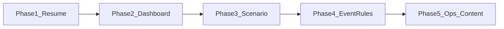

# Classroom Hardening & Content Roadmap — Implementation Plan

> **For agentic workers:** REQUIRED SUB-SKILL: Use `superpowers:subagent-driven-development` (recommended) or `superpowers:executing-plans` to implement this plan phase-by-phase. Steps use checkbox (`- [ ]`) syntax for tracking.
>
> **Scope note:** This is a **multi-stage roadmap**. Implement **one phase at a time**, merge/deploy, then start the next. Do not start Phase 4–5 until Phase 1–2 are live on Plesk.

**Goal:** Make GOAL classroom-ready for real school use: students can resume across devices, teachers get a usable live dashboard, rooms bind scenarios, events become richer and maintainable — without premature CMS/LLM/OAuth.

**Architecture:** Keep month simulation, scoring, and event content evaluation in the browser (`packages/simulation-engine`, `packages/game-content`, `packages/scoring-engine`). MariaDB/`apps/api` owns identity, classrooms, memberships, cloud `game_runs`, and aggregates. New features prefer thin API + existing UI patterns (`ClassroomAuthModal`, `ClassroomModal`, `api/client.ts`).

**Tech Stack:** Express + mysql2 (`apps/api`), React + Zustand + Vite (`apps/player-web`), TypeScript packages, MariaDB on Plesk, nodemailer/sendmail for teacher mail.

## Global Constraints

- Domain / public URL: `https://vorsorgenavigator.stoffner.de`
- API Application Root: `apps/api`, startup `app.js`
- Frontend Document Root: `apps/player-web/dist`; same-origin `/api` (no baked `localhost:3001`)
- Do **not** move month simulation server-side in these phases
- Do **not** add LLM/OAuth in these phases
- Secrets stay in server `.env` only (never commit)
- German UI copy; aliases only for students (no Klarname required)
- Prefer idempotent migrations via `apps/api/src/db/migrate.js` + `schema.sql`
- After each phase: `npm test`, `npm run build --workspace=apps/player-web`, smoke on Plesk checklist items for that phase

---

## File map (by responsibility)

| Area | Primary files |
|---|---|
| Auth / mail | `apps/api/src/routes/auth.js`, `apps/api/src/mail.js` |
| Classrooms / join / summary | `apps/api/src/routes/classrooms.js` |
| Cloud save | `apps/api/src/routes/runs.js` |
| Schema | `apps/api/schema.sql`, `apps/api/src/db/migrate.js` |
| API client | `apps/player-web/src/api/client.ts` |
| Teacher/student auth UI | `apps/player-web/src/components/ClassroomAuthModal.tsx` |
| Dashboard | `apps/player-web/src/components/ClassroomModal.tsx` |
| Game cloud sync | `apps/player-web/src/store/gameStore.ts` |
| Events engine | `packages/simulation-engine/src/engine/eventEngine.ts` |
| Event content | `packages/game-content/src/events.ts` |
| Shared event types | `packages/shared-types` (LifeEvent interfaces) |
| Ops docs | `docs/plesk-go-live-checklist.md`, `apps/api/README.md` |

---

## Phase overview



| Phase | Outcome | Deploy when |
|---|---|---|
| **1** Student resume | Same alias can continue on another device | Before next class session |
| **2** Dashboard UX | Live-enough class view + age/status | Same week as Phase 1 |
| **3** Room scenario | Teacher locks scenario for the room | Before structured lessons |
| **4** Event rules | Richer eligibility + content hygiene | After classroom loop stable |
| **5** Ops + light CMS | GDPR delete, optional event JSON admin | School-year ops |

**Out of roadmap (explicit):** server-side month sim, LLM, Schul-SSO/OAuth, full editorial CMS, Phaser.

---

### Task / Phase 1: Student resume across devices

**Files:**
- Modify: `apps/api/schema.sql`, `apps/api/src/db/migrate.js`
- Modify: `apps/api/src/routes/classrooms.js`
- Modify: `apps/player-web/src/api/client.ts`
- Modify: `apps/player-web/src/components/ClassroomAuthModal.tsx`
- Modify: `docs/plesk-go-live-checklist.md`
- Test: add `apps/api/scripts/smoke-resume.js` (optional) or extend `scripts/smoke.js`

**Interfaces:**
- Consumes: existing `POST /api/classrooms/join` body `{ roomCode, alias }`
- Produces:
  - `POST /api/classrooms/join` accepts optional `pin` (4–6 digits) on first join; stores `pin_hash` on `memberships`
  - Same `roomCode` + `alias` + correct `pin` → **re-issues** `sessionToken`, returns existing `membershipId` / cloud run
  - Wrong pin → `401`; missing pin on existing membership → `401` with `needsPin: true`

**Design (chosen):** Resume PIN (recommended over magic links — works offline-ish, no student email).

- [ ] **Step 1: Extend schema**

Add to `memberships` in `schema.sql` and `ALTER` in `migrate.js`:

```sql
pin_hash VARCHAR(255) NULL,
last_seen_at DATETIME NULL
```

- [ ] **Step 2: Update join route**

In `classrooms.js` `POST /join`:

1. Resolve classroom by `room_code` (unchanged expiry checks).
2. Look up membership by `(classroom_id, alias)`.
3. **If none:** require `pin` (4–6 digits), bcrypt-hash, INSERT membership + empty `game_runs`, return new session.
4. **If exists:** require `pin`, bcrypt.compare; on success rotate or keep `session_token` (prefer **rotate** token, UPDATE row, set `last_seen_at`), return session + hint to load cloud run.
5. Remove hard 409 on duplicate alias (replace with pin gate).

- [ ] **Step 3: Frontend join form**

In `ClassroomAuthModal` JOIN mode: add PIN field; persist session as today; on `needsPin` show clear error.

- [ ] **Step 4: Client helper**

`joinClassroom(roomCode, alias, pin)` in `client.ts` sends `pin`.

- [ ] **Step 5: Manual acceptance**

1. Join as `Fuchs42` / pin `1234`, play, save.
2. Clear site data / other browser → same room + alias + pin → cloud state loads.
3. Wrong pin → no access.

- [ ] **Step 6: Commit**

```bash
git commit -m "feat: allow student resume via room alias and PIN"
```

**Phase 1 done when:** Checklist item „Gerät wechseln“ works without copying localStorage.

---

### Task / Phase 2: Teacher dashboard hardening

**Files:**
- Modify: `apps/api/src/routes/classrooms.js` (summary already has `currentAge` — ensure JSON includes it)
- Modify: `apps/player-web/src/components/ClassroomModal.tsx`
- Modify: `apps/player-web/src/api/client.ts` if types needed

**Interfaces:**
- Consumes: `GET /api/classrooms/:id/summary`
- Produces: UI shows `currentAge`, `isGameOver`, optional last activity; auto-refresh every 30s while modal open

- [ ] **Step 1: Extend member row UI**

In `ClassroomModal` member list columns: Alias | Alter | Status (läuft / fertig Note) | Score.

- [ ] **Step 2: Polling**

`useEffect` with `setInterval(30000)` calling `loadSummary(selectedId)`; clear on unmount / classroom change. Show „Aktualisiert …“ timestamp.

- [ ] **Step 3: Wire certificate list (light)**

For finished members, optional button „Zertifikat“ calling existing `fetchCertificate(classroomId, runId)` and print view — or link into CERTIFICATE tab with loaded payload. Do **not** invent new scoring server-side.

- [ ] **Step 4: Manual acceptance**

Two students join → teacher dashboard shows both ages updating after cloud saves (within ~30s after refresh/poll).

- [ ] **Step 5: Commit**

```bash
git commit -m "feat: classroom dashboard age, status, and polling"
```

**Phase 2 done when:** Teacher can monitor a live class without reloading the whole app manually (poll is enough; no WebSocket required).

---

### Task / Phase 3: Bind scenario to classroom

**Files:**
- Modify: `apps/api/src/routes/classrooms.js` (`POST /` already accepts `scenarioId` — verify persistence)
- Modify: `apps/player-web/src/api/client.ts` `createClassroom(title, scenarioId?)`
- Modify: `apps/player-web/src/components/ClassroomAuthModal.tsx`
- Modify: `apps/player-web/src/components/ClassroomAuthModal.tsx` / join → `gameStore` / scenario flow
- Possibly: `WelcomeScreen` / scenario modal skip when `scenarioId` present

**Interfaces:**
- Consumes: content scenario IDs from `@goal/game-content`
- Produces: create room with `scenarioId`; join response includes `classroom.scenarioId`; student UI auto-starts that scenario (no free picker) when set

- [ ] **Step 1: Teacher create UI**

Dropdown of known scenarios when creating a room; send `scenarioId` in `POST /api/classrooms`.

- [ ] **Step 2: Student join path**

After join + cloud load: if no cloud state and `scenarioId` set → call `startNewGame` / scenario setup with that id; skip `SCENARIO_SELECTION_MODAL`.

- [ ] **Step 3: Dashboard show scenario**

Show scenario name next to room code in `ClassroomModal`.

- [ ] **Step 4: Acceptance**

Room created with scenario X → student never sees other scenarios for that join.

- [ ] **Step 5: Commit**

```bash
git commit -m "feat: bind classroom to a fixed scenario"
```

**Phase 3 done when:** A lesson can force one pedagogical path for the whole class.

---

### Task / Phase 4: Richer event rules + content hygiene

**Files:**
- Modify: `packages/shared-types` LifeEvent type (add optional `requires` / `excludes` flags)
- Modify: `packages/simulation-engine/src/engine/eventEngine.ts` `getEligibleEvents`
- Modify: `packages/game-content/src/events.ts` (annotate 5–10 events)
- Modify: `packages/simulation-engine/test/events.test.ts`
- Docs: short `docs/events-authoring.md` (how to add an event in code)

**Interfaces:**
- Consumes: `GameState` fields already available (housing, insurance, career, family, metrics)
- Produces: eligibility filter beyond age + `pastEvents`, e.g.:

```ts
requires?: {
  hasHaftpflicht?: boolean;
  hasPartner?: boolean;
  isHomeOwner?: boolean;
  minEmergencyMonths?: number;
};
excludes?: { /* same shape, inverted */ };
```

- [ ] **Step 1: Failing tests** for eligibility (event with `requires.hasHaftpflicht` not eligible without policy; eligible with policy).

- [ ] **Step 2: Implement filter in `getEligibleEvents`** (keep age + pastEvents; add requires/excludes).

- [ ] **Step 3: Annotate existing events** where it matters (water damage → haftpflicht; roof leak → owner; baby → partner optional, etc.). Keep probabilities unless tests demand tweak.

- [ ] **Step 4: Authoring doc** listing fields + how `pastEvents` prevents repeats + age-18 forced event.

- [ ] **Step 5: Commit**

```bash
git commit -m "feat: extend life-event eligibility rules"
```

**Phase 4 done when:** New events can encode situational gates in TypeScript without DB CMS; tests cover gates.

**Explicitly NOT in Phase 4:** Admin UI, DB event tables.

---

### Task / Phase 5: Ops, GDPR, light content admin (optional stretch)

**Files:**
- Modify: `apps/api/src/routes/classrooms.js` — `DELETE /api/classrooms/:id` (teacher-owned cascade)
- Modify: `apps/api/src/routes/auth.js` — optional `DELETE /api/auth/teacher/me` (cascade teacher data) **or** document SQL-only
- Modify: `ClassroomModal.tsx` — „Klasse löschen“ with confirm
- Create: `docs/ops-dsgvo.md` — retention, manual SQL, delete button behavior
- Optional light CMS (only if still needed after Phase 4):
  - `GET/PUT /api/admin/events-override` storing JSON blob in new table `content_overrides` — **YAGNI default: skip** unless product owner insists

**Interfaces:**
- Consumes: teacher JWT
- Produces: hard delete classroom → memberships/runs/evaluations via FK CASCADE; checklist updated

- [ ] **Step 1: DELETE classroom API + UI confirm**

- [ ] **Step 2: Ops doc** (school-year wipe procedure)

- [ ] **Step 3: Real QR (optional)** — generate QR image from room code URL `https://vorsorgenavigator.stoffner.de/?join=CODE` (add join deep link if missing)

- [ ] **Step 4: Commit**

```bash
git commit -m "feat: classroom delete and GDPR ops notes"
```

**Phase 5 done when:** Teacher can remove a class without phpMyAdmin; ops doc exists.

---

## Deployment ritual (after each phase)

```bash
cd /var/www/vhosts/stoffner.de/vorsorgenavigator.stoffner.de
git pull
cd apps/api && npm install && npm run migrate
# restart Node app in Plesk
cd ../player-web && npm install && npm run build
# confirm dist/index.html asset hash changed; hard-reload browser
```

Mail must stay on working transport (`SMTP_TRANSPORT=sendmail` or `127.0.0.1:25`).

---

## Self-review

1. **Spec coverage:** Resume, dashboard, scenario bind, event rules, ops/GDPR, QR — each has a phase. CMS/LLM/OAuth/server-sim explicitly deferred.
2. **Placeholders:** None intentional; Phase 5 CMS marked YAGNI/skip by default.
3. **Dependencies:** Phase 3 join UX assumes Phase 1 pin join still works; Phase 2 independent of 1 but deploy after 1 for classroom value.

---

## Success criteria (full roadmap)

- Teacher verifies email, creates room with scenario, shares code (+ QR optional).
- Students join with alias+PIN, play, switch device with same alias+PIN, continue cloud save.
- Dashboard shows live-enough aggregates, ages, status; teacher can delete class at year end.
- Events respect situational eligibility; authors edit `events.ts` with a short guide.
- No requirement for LLM or full CMS to run a school lesson.
