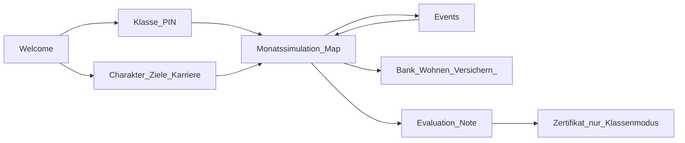

# Next Steps: Spielablauf & Erweiterungen (nach Classroom-Hardening)

> Stand: nach Merge-Kandidat `feature/classroom-hardening` (PIN-Resume, Dashboard, Szenario-Bindung, Event-Eligibility, Klassen-Löschen).  
> Ziel: den **Lebenslauf im Spiel** spürbar voller machen und Lehrer-Nachbereitung stärken — ohne CMS/LLM/SSO.

**Architektur-Konstante:** Monatssimulation, Events und Scoring bleiben clientseitig (`packages/simulation-engine`, `game-content`, `scoring-engine`). API/MariaDB nur für Klasse, Auth, Cloud-Save, Aggregate.

---

## Spielablauf heute (Ist)

**Wo es dünn wird:** Events enden inhaltlich ~Alter 45; Karriere kaum steuerbar; Abschluss-UI veraltet; Reise-Ziel kaum erreichbar; nach Event-Wahl wenig Lernfeedback; Cloud-Save unsichtbar.

---

## Phase A — Spielablauf-Fixes (1–2 Sprints, höchster Impact)

| # | Thema | Warum | Schwerpunkt |
|---|---|---|---|
| A1 | Abschluss-UI an `scenarioEndAge` / 67 | „mit 30“ / Dateiname falsch trotz Scoring bis 67 | `EvaluationView.tsx` |
| A2 | Solo-Zertifikat / Finanzführerschein | Welcome verspricht es; Print nur im Klassen-Modal | `EvaluationView` + Shared Certificate-Komponente |
| A3 | Events Alter 46–67 + dichtere 25–45 | Sonst lange ereignislose Jahre | `events.ts`, Tests, Authoring-Doc |
| A4 | Nach-Event-Feedback | Entscheidung → kurze Konsequenz + Lernhint | `EventModal`, `handleEventChoice` |
| A5 | `GOAL_REISEN` erreichbar | Ziel verlangt 2 Reisen, Content liefert max. 1 | `events.ts` / `goalEngine` |
| A6 | Karriere-Interaktion | CareerModal read-only; Gehalt „passiert“ | `CareerModal`, optional Choices im Monat |

**Erfolg Phase A:** Ein Solo-Lauf bis Szenario-Ende fühlt sich bis zum Schluss „lebendig“ an und endet mit korrekter Note + Zertifikat.

---

## Phase B — Klassenraum & Unterricht (parallel / danach)

| # | Thema | Warum |
|---|---|---|
| B1 | Cloud-Save-Status in der UI | Schüler sehen Sync/Fehler |
| B2 | CSV-/Klassenexport | Nachbesprechung ohne Screenshots |
| B3 | `expires_at` setzen + optional Auto-Hinweis | Schuljahr-Ops |
| B4 | Charakter-Name vor Szenario-Schnellstart | Kein hartes „Alex“ beim Klassen-Join |
| B5 | Lehrer-Konto löschen (Self-Service) | DSGVO über SQL hinaus |

**Erfolg Phase B:** Lehrer kann Stunde vorbereiten, begleiten und nachbereiten ohne phpMyAdmin.

---

## Phase C — Content-Tiefe (Pedagogik)

| # | Thema | Warum |
|---|---|---|
| C1 | Neue Szenarien (Versicherung, Rente/bAV, Steuern, Mobilität) | Nur 4 Module heute |
| C2 | Lernkarten → `knowledgePoints` / Literacy | Sonst totes Content-Feature |
| C3 | Event-Bilder / Mapping aufräumen | Viele Events fallen auf Placeholder |
| C4 | Mehr `requires`/`excludes` auf Midlife-Events | Eligibility-Engine nutzen |
| C5 | Phone/soziale Schicht an Events koppeln | Sonst Dekoration |

---

## Phase D — Später (bewusst nicht jetzt)

- Light Content-CMS / Events in DB  
- LLM-adaptive Tipps  
- Schul-SSO / OAuth  
- Server-seitige Monatssimulation  

---

## Empfohlene Reihenfolge

1. **A1 + A2 + A5** (schnelle Qualitätswins, wenig Risiko)  
2. **A3 + A4** (Kern-Spielgefühl)  
3. **A6** (Karriere)  
4. **B1 + B4 + B2** (Unterricht)  
5. **C1–C4** nach Bedarf der Lehrkräfte  

---

## Abgrenzung zu Hardening

Nicht nochmal bauen: PIN-Resume, Dashboard-Polling, Szenario-Bindung am Raum, Event-Eligibility-Grundlage, Klassen-Löschen, QR/`?join=`.

---

## Offene Produktfrage (vor Implementierung)

Priorität der nächsten Umsetzung:

**A)** Spielablauf-Fixes A1–A5 zuerst (Empfehlung)  
**B)** Lehrer-Export/Cloud-Save B1–B2 zuerst  
**C)** Neue Midlife-/Senior-Events A3 zuerst  

Nach Entscheidung: detaillierter Implementation-Plan für die gewählte Spur (wie beim Classroom-Hardening).
